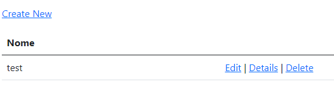

<h1 align="center"> CRUD PostgreSQL </h1>

Projeto CRUD com PostgreSQL.  

  <a href="#-tecnologias">Tecnologias</a>&nbsp;&nbsp;&nbsp;|&nbsp;&nbsp;&nbsp;
  <a href="#-projeto">Projeto</a>&nbsp;&nbsp;&nbsp;|&nbsp;&nbsp;&nbsp;
  <a href="#memo-licença">Licença</a>

  

 

  

## 🚀 Tecnologias

Esse projeto foi desenvolvido com as seguintes tecnologias:

- C#
- Aplicativo Web do ASP.NET Core MVC (Framework)
- PostgreSQL v.15
- Github
- Visual Studio 2022

## 💻 Projeto

Um mini projeto sobre crud mvc usando banco de dados postgres, asp.net core(.NET 6), para ter uma noção de gerenciamento de dados.

## :memo: Licença

Esse projeto está sob a licença MIT.
